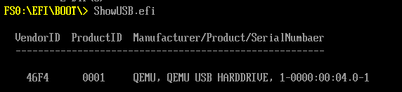

## Print list of all USB devices hase been connected
### With best regards to : https://github.com/fpmurphy/UEFI-Utilities-2019
In this project you can print a list of connected usbs in an efi applicatuion by following steps:

### Prepare a dummy usb :
#### Create a dummy image that woks as a usb 
With Quemu assumed installed from the README file in **CreateProjectClion** folder you can just make an image file and dump it to a dummy usb by following command:

```bash
$ qemu-img create test2.img 1G
```

#### Lets Print that usb
After cloning the above project and created the efi file or just copy the efi that has been created into the mounted path at */EFI/BOOT/*, and run the following command:

```bash
$ sudo qemu-system-x86_64 -L . --bios ~/Documents/OVMF.fd -hda ~/Documents/test.img -hdb /dev/loop45 -boot d -m 256 -device piix3-usb-uhci \
    -drive id=my_usb_disk,file=test2.img,if=none \
    -device usb-storage,drive=my_usb_disk


```

Noticed my mounted device name is : */dev/loop45* . 
and remmeber to customize following paths : the OVMF, test.image (Our boot device emulated) and the test2.img (Our USB device emulated)

## Screenshots



